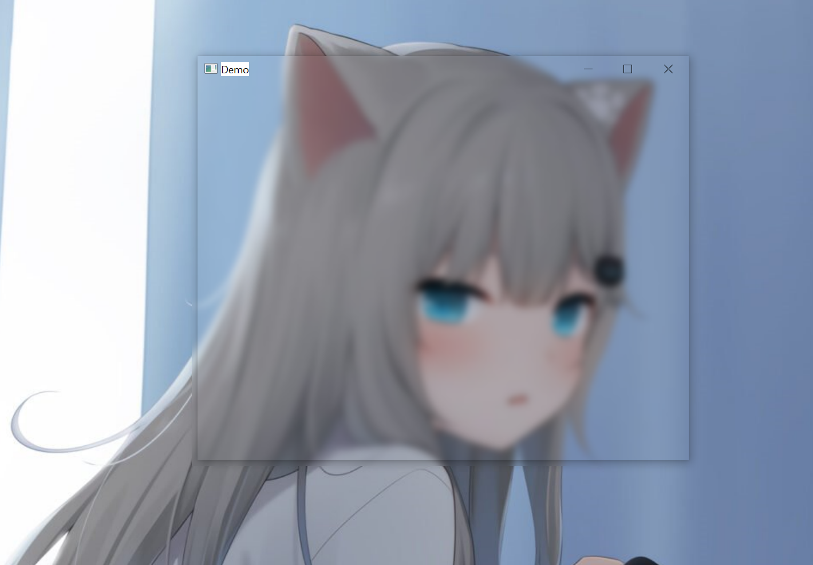

# AcrylicWindow

> Win10 Acrylic(亚克力)、Win11 mica(云母)、Win7 Aero Glass(毛玻璃)；也就是通常说的 **透明磨砂** 效果；

<br>

###  Acrylic Material Document

| OS VERSION | APPELLATION                    | SDK                               | EXPLAIN                                                      |
| ---------- | ------------------------------ | --------------------------------- | ------------------------------------------------------------ |
| Windows 7  | Aero Glass / 毛玻璃 / 磨砂玻璃 | `extendFrameIntoClientArea()`     | only Windows 7 / Vista                                       |
| Windows 10 | Acrylic Material / 亚克力 材质 | `SetWindowCompositionAttribute()` | [MSDN DOC](https://docs.microsoft.com/en-us/windows/apps/design/style/acrylic) |
| Windows 11 | Mica / 云母                    | `SetWindowCompositionAttribute()` | [MSDN DOC](https://docs.microsoft.com/en-us/windows/apps/design/signature-experiences/materials) |

<br>

### Project

- **『BlurEffect』** 属奇思妙想，实现简单且跨平台，属 **等效** 跨平台透明磨砂效果；**原理: ** 在显示窗口的底层放一个 <u>"QWidget + 图片 + QGraphicsBlurEffect"</u> 作为铺垫
- **『AcrylicMaterial + Demo』** 生成 `AcrylicMaterial.dll`， `Demo.exe`  调用上面  `AcrylicMaterial.dll` 的接口，显示一个 QWidget 窗口。**原理: ** 调用 Windows 10/7 SDK 不公开的 API
- 矩阵逐个点去磨砂
- qss？

<br>

### Show



<br>


<br>

### Aero Glass

```cpp
// 仅支持 windows 7 的毛玻璃 磨砂 透明  Aero Glass 效果
#ifdef Q_OS_WIN
    // 添加 winextras
   #include <QtWin>
    this->setAttribute(Qt::WA_TranslucentBackground);
    QtWin::enableBlurBehindWindow(this);
    QtWin::extendFrameIntoClientArea(this, -1, -1, -1, -1);
#endif
```

<br>

### Note

If the running background images does not load, please check

- `.dll` Path
- `Image` Path

<br>

###   Acrylic Material 

1. [https://github.com/wangwenx190/Win32Acrylic](https://github.com/wangwenx190/Win32Acrylic)
2. [https://github.com/Qt-Widgets/qtacrylicmaterial](https://github.com/Qt-Widgets/qtacrylicmaterial)
3. [https://github.com/zhiyiYo/PyQt-Frameless-Window](https://github.com/zhiyiYo/PyQt-Frameless-Window)

<br>

### Refecnces

1. [亚克力效果的实现思路](https://www.cnblogs.com/zhiyiYo/p/14644609.html)   『本项目主要参考此文，后略作修改』
2. [使用 SetWindowCompositionAttribute 来控制程序的窗口边框和背景](https://blog.walterlv.com/post/set-window-composition-attribute.html)
3. DDE 透明磨砂效果原理： [deepin-wm 的动态背景模糊实现](https://github.com/linuxdeepin/deepin-mutter/blob/release/3.20/src/compositor/meta-blur-actor.c)

